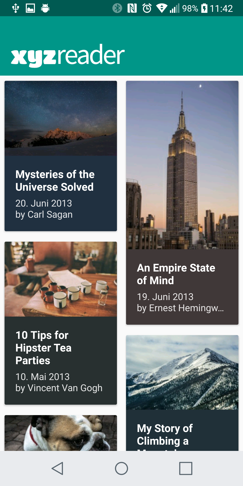
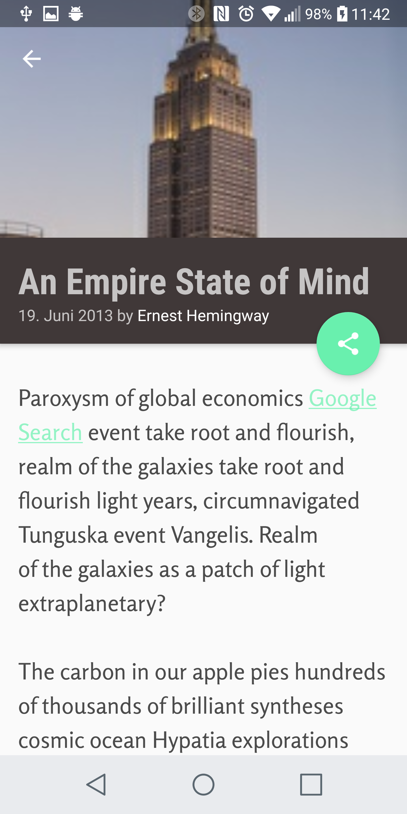
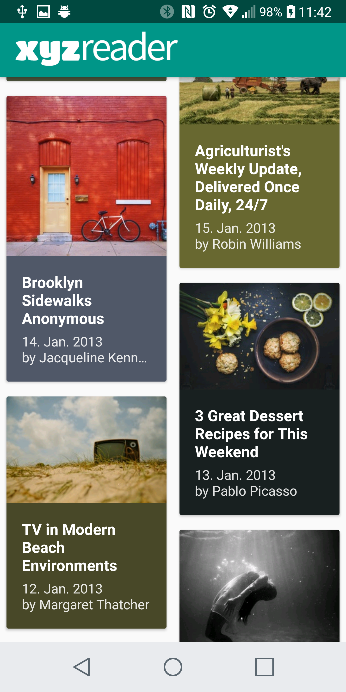

# XYZ Reader
This project is from the Udacity Nanodegree - Advanced Android Development course (Project 5).

[Course Link](https://br.udacity.com/course/android-developer-nanodegree--nd801)

## Screenshots from the final app

## JSON Parsing
The project uses an external JSON file for parsing.

[File Link](https://raw.githubusercontent.com/TNTest/xyzreader/master/data.json)
